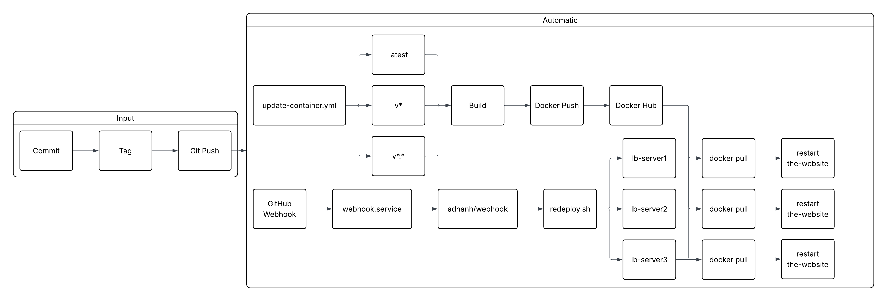

## Project 5

### Continuous Development Project Overview

The goal of this project is to create a development pipeline that performs a few important deployment steps when updates to a static html website are committed, tagged, and pushed to GitHub. The tools used in this project are **GitHub**, **GitHub Workflows**, **Docker**, **Docker Hub**, **Webhook**, and **Amazon Web Services**. **GitHub** was used for version control, **GitHub Actions** was used to the website Docker Hub image, **Docker** was used to run and build a containerized website, **Webhook** was used to get triggers to restart the containerized website, and **Amazon Web Services** was used to host the proxy and server instances that host the website instances and manage their containers. This project includes the extra credit implimentation of a load balancer in which each website instance is updated at once through [redeploy.sh](deployment/redeploy.sh) Here is a diagram depicting the continuous deployment pipeline this project is centered around:



### EC2 Instance Details

The amazon machine image (AMI) used for `lb-proxy` and `lb-serverx` formation is `Ubuntu 24.04 LTS (HVM), SSD Volume Type` with an AMI id of `ami-0b6c6ebed2801a5cb`. The recommended volume size for this image is quite small, at `8 GiB`. The configuration of the public and private security groups used in `lb-proxy` and `lb-serverx` are, respectively, as follows:
```yml
ProxySecurityGroup:
    Type: "AWS::EC2::SecurityGroup"
    Properties:
      VpcId: !Ref VPC
      GroupDescription: Enable SSH access from trusted sources.  Port 80 or 443 access from appropriate sources
      SecurityGroupIngress:
        - IpProtocol: tcp
          FromPort: "22"
          ToPort: "22"
          CidrIp: 192.168.0.0/23 # Allow SSH within the VPC
        - IpProtocol: tcp
          FromPort: "22"
          ToPort: "22"
          CidrIp: 130.108.0.0/16 # Allow SSH within Wright State
        - IpProtocol: tcp
          FromPort: "22"
          ToPort: "22"
          CidrIp: Censored # Allow SSH from home
        - IpProtocol: tcp
          FromPort: "80"
          ToPort: "80"
          CidrIp: 192.168.0.0/23 # Allow HTTP within the VPC
        - IpProtocol: tcp
          FromPort: "80"
          ToPort: "80"
          CidrIp: 0.0.0.0/0 # Allow HTTP from anywhere
        - IpProtocol: icmp
          FromPort: "-1"
          ToPort: "-1"
          CidrIp: 0.0.0.0/0 # Allow ICMP from anywhere
        - IpProtocol: tcp
          FromPort: "8080"
          ToPort: "8080"
          CidrIp: 0.0.0.0/0 # Allow TCP for haproxy/stats
      Tags:
        - Key: Name
          Value: LB-proxy-sg
  PoolSecurityGroup:
    Type: "AWS::EC2::SecurityGroup"
    Properties:
      VpcId: !Ref VPC
      GroupDescription: Enable SSH access from trusted sources.  Port 80 or 443 access from appropriate sources
      SecurityGroupIngress:
        - IpProtocol: tcp
          FromPort: "22"
          ToPort: "22"
          CidrIp: 192.168.0.0/24 # Allow SSH from the proxy
        - IpProtocol: tcp
          FromPort: "80"
          ToPort: "80"
          CidrIp: 192.168.0.0/23 # Allow HTTP from the VPC
        - IpProtocol: icmp
          FromPort: "-1"
          ToPort: "-1"
          CidrIp: 0.0.0.0/0 # Allow ICMP from anywhere
      Tags:
        - Key: Name
          Value: LB-pool-sg
```

The `ProxySecurityGroup` that is used by the public instance contains the [deployment](deployment) scripts, load balancing software, and webhook service. `lb-proxy` is what sends users to their appropriate `lb-serverx`. It also manages each `lb-serverx` by [redeploying](deployment/redeploy.sh) it when `lyalls2004/the-website:latest` is updated on Docker Hub. The `ProxySecurityGroup` enables `ssh` and `icmp` connections from trusted locations and specifically any location on port `8080` to allow the load balancer stats page to be visible. All ips are allowed for `http` and `icmp` connections so anyone can access the website while it is up.

The `PoolSecurityGroup` is much more stringent in its filtering to ensure only `ssh` and `http` within the VPC is allowed. All external connections are managed through the NAT Gateway and `lb-proxy` to ensure that unknown direct connections to any `lb-serverx` are highly unlikely. It is important to protect these servers because they house the website containers, and they should not be tampered with outside of automated processes such as redeployment after an update.

### Docker Setup in the EC2 Instance

Installing Docker in the EC2 instances is done automatically during cloudformation. This is done automatically for each `lb-serverx`. `curl -fsSL https://get.docker.com -o get-docker.sh` and `sh ./get-docker.sh` are ran to install Docker with the `get-docker.sh` script provided by Docker. To confirm that Docker was successfully installed on the instance, `docker run hello-world` can be ran to ensure that pulls from Docker Hub are functional and Docker is active on the system.

### Testing on the EC2 Instance

To pull the `lyalls2004/the-website:latest` Docker image from its Docker Hub repository in the EC2 instance run `sudo docker pull lyalls2004/the-website:latest`. To run the container image in the background to test if the website works, run `docker run -d --restart always -p 80:80 lyalls2004/the-website:latest`. Go to the `lb-proxy` instance's public ip to check if the website works. To check for mistakes in the container, run `docker run -it --restart always -p 80:80 lyalls2004/the-website:latest bash`. It is recommended to us the `-d` flag after testing is complete, as it allows commands to continue to be ran in the `lb-serverx` instances so [redeploy.sh](deployment/redeploy.sh) can be easily ran later on.

### Redeploy Script

[redeploy.sh](deployment/redeploy.sh) is a small bash script that uses `ssh` to run commands in each `lb-serverx` to redeploy each website container after a new image was pushed to the Docker Hub repository. It takes slightly under a minute to deploy the new image with [update-container.yml](.github/workflows/update-container.yml), so a one minute wait time is built into the script The script uses a for loop that runs an `ssh` command for each `lb-serverx` private ip. `ssh -i ~/Keys/ceg3120-vockey.pem ubuntu@$server "bash -s" <<'EOF'` runs the following bash commands until an `EOF` is reached:
```bash
docker pull lyalls2004/the-website:latest
docker stop the-website
docker rm the-website
docker run -d --restart always -p 80:80 --name the-website lyalls2004/the-website:latest
```

The `lyalls2004/the-website:latest` container is pulled from Docker Hub, the old container is stopped and removed, and the container is restarted with the up-to-date image. To verify that the script ran, `sudo docker ps -a` can be ran in each `lb-serverx` to check which time the container was started. Here is the [redeploy.sh](deployment/redeploy.sh) file in this repository.

### Configuring a Webhook Listener in the EC2 Instance

Install adnanh's webhook with `sudo apt install webhook` and verify that it is installed with `webhook --version`. The [webhook definition file](deployment/hooks.json) consists of an `id` that names an action the webhook performs. The executed command and working directory are also supplied below the `id`. When the [webhook](deployment/hooks.json) is ran, [redeploy.sh](deployment/redeploy.sh) is executed and the containers in each `lb-serverx` are restarted. To verify that the definition file was loaded by webhook, trigger the webhook with `http://*:9000/hooks/redeploy-webhook` in a browser where `*` is the public ip of the instance with the listening webhook. Run `/usr/bin/webhook -hooks /var/scripts/hooks.json -verbose` to make webhook start listening and display its output. To check that the docker containers were successfully restarted, the output of webhook should show that `the-website` was removed then added. Here is the [webhook definition](deployment/hooks.json) file in this repository.

### Configuring a Webhook Service in the EC2 Instance

The [webhook service file](deployment/webhook.service) contains a description of the service, when to load the service, and what the service does. The [webhook.service](deployment/webhook.service) is a simple service that runs with the user and group `root`. When the service is ran, it automatically runs `/usr/bin/webhook -hooks /var/scripts/hooks.json -verbose` until the command is successfully ran, then it listens for webhook payloads. The following commands are used to start the service, assuming that `sudo systemctl daemon-reload` has been ran when updates to appropriate files have been made:
```bash
sudo systemctl enable webhook.service
sudo systemctl start webhook.service
```

[webhook.service](deployment/webhook.service) will now run automatically when a user `ssh`s into the instance. `sudo journalctl -u webhook.service -f` can be ran to view the service logs in real time to verify that the appropriate commands and processes are being ran when a payload is sent to the webhook. The output of [redeploy.sh](deployment/redeploy.sh) is also visible using `sudo journalctl -u webhook.service -f`. Here is the [webhook.service](deployment/webhook.service) file in this repository.

### Configuring a Payload Sender

GitHub was chosen to send the webhook payload because it can detect both repository pushes and new tags for the Docker Hub repository. To make GitHub send a payload to the listening webhook: 
- Go to the project repository and select **Settings** in the top bar.
- Select **Webhooks** in the side bar.
- Add a webhook with the **Payload URL** as `http://*:9000/hooks/redeploy-webhook` where `*` is the public ip of the instance with the listening webhook.
- Set the **Content Type** to `application/json`.
- Enable **SSL Verification** for extra security.
- Configure the webhook to trigger on tag or push.

The payload will not trigger the webhook unless a shared secret visible in [hooks.json](deployment/hooks.json) is correctly matched with GitHub. It also checks for a payload type and header that matches GitHub. `sudo journalctl -u webhook.service -f` can still be used to monitor if the payload was sent correctly. To check if it only triggers with GitHub, you can try triggering the webhook through some other method such as a browser with `http://*:9000/hooks/redeploy-webhook` where `*` is the public ip of the instance with the listening webhook. The message `Hook rules were not satisfied.` will appear if the payload was not sourced from GitHub and/or the shared secret was absent or incorrect.

### Resources

> I used this website to learn how to run commands in private shells with ssh. https://askubuntu.com/questions/204065/how-to-run-local-shell-script-on-remote-server-via-ssh

> I used this website to learn how to set up webhook. https://github.com/adnanh/webhook

> I used this website to learn how to make a webhook service file. https://mintlify.wiki/myk-org/github-webhook-server/deployment/systemd

> I used this website to learn how to handle a github webhook. https://docs.github.com/en/webhooks/webhook-events-and-payloads