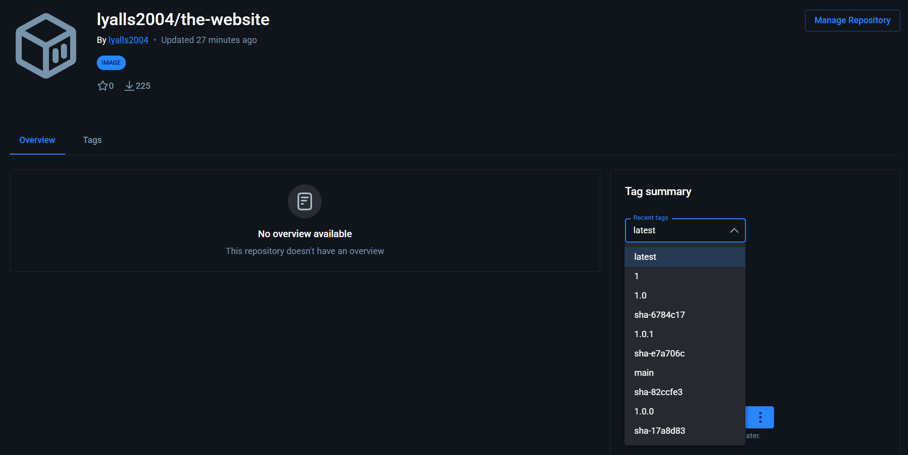
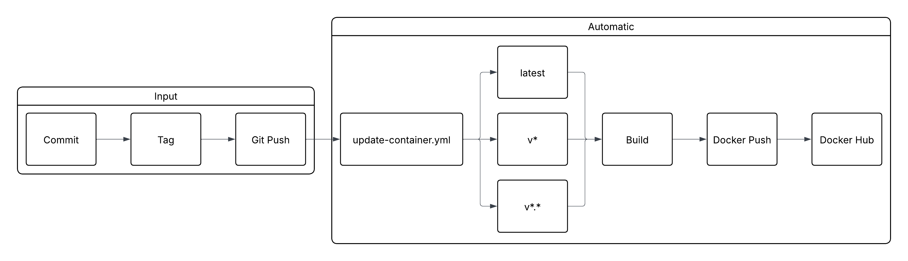

## Project 4

### Dockerfile & Building Images

Within the container built with [Dockerfile](Dockerfile) is some static [web content](web-content). The [web content](web-content) is served through the container in port 80, and can be accessed through the same port from outside the container if it is port bound properly.

The commands ran to build, tag, push, pull, and run the container using the [Dockerfile](Dockerfile) are as follows (you must be in the directory of [Dockerfile](Dockerfile) to use this build command):
- Building: `docker build -t the-website:latest .`
- Tagging: `docker tag the-website:latest lyalls2004/the-website:latest`
- Pushing: `docker push lyalls2004/the-website:latest`
- Pulling (in the container): `docker pull lyalls2004/the-website:latest`
- Running (in the container): `docker run -d -p 80:80 lyalls2004/the-website:latest`

### Configuring Github Repository Secrets

To generate a personal access token on Docker Hub, select your **profile**, open **account settings**, select **generate new token**, add a **description**, **expiration date**, and **access permissions**, and select **generate**. This new key must be pasted in terminal to log you in to your Docker Hub account when prompted. You can not view this key again, so it is important to save it. It is recommended to only make tokens when necessary (specific permissions are needed). For the strongest security, different tokens can be used for read, write, and delete access so one token doesn't grant full access to your account. For this project, it is recommended to use a personal access token with only `Read & Write` permissions.

The two repository secrets used in this project are called `DOCKER_USERNAME` and `DOCKER_TOKEN`, they hold the username and personal access token of the account that owns the repo for the container in [web content](web-content). They are important because in order to push changes to a repository in Docker Hub, you need a username and personal access token, and the tag for the image has to match the username. To create a repository secret, go to the repository **settings** and select **Actions** under **Secrets and variables** and **Security and quality**. Select **New repository secret** under **Repository secrets** and fill out the **Name** and **Secret** fields. Select **Add secret** to finalize the new secret.

### CI with Github Actions

The trigger that sets off the [Update Container](.github/workflows/update-container.yml) action is when a commit is pushed in main exclusively or a pull request is created. This is so the Docker Hub image is only updated when changes are completed and verified correct, not when commits are being made.

The workflow is completed in one step, aided by `docker/build-push-action@v7`. [update-container.yml](.github/workflows/update-container.yml) was taken largely from Docker's github page for the build-push action, but some minor edits needed to be made for this project, such as a specified location for the [Dockerfile](Dockerfile) and a different location for the `DOCKER_USERNAME` secret. The step begins by logging the user in with the `DOCKER_USERNAME` and `DOCKER_TOKEN` then setting up `qemu` and `buildx`. `qemu` is a tool that allows `ARM64` and `AMD64` operating systems such as MAC to build the image, and `buildx` creates an environment to enable additional build features. Under the `Build and Push` section, `file` specifies the location of the [Dockerfile](Dockerfile), `push` causes the built image to be pushed after building, and `tags` correctly tags the image so it can be pushed to Docker Hub under the correct name and version.

If [update-container.yml](.github/workflows/update-container.yml) is used in a different repository and with a different image name, the `file` and `tags` fields will need to be updated.

### Testing & Validating

To test that the workflow correctly performed its tasks, select **Actions** in the top bar of the repository. The action should be queued, which means it is preparing to be ran. When running is complete, it will either be successful or it will fail. If it fails, click the action to view the action logs. Any errors during the action can be viewed and addressed from there.

To verify that the `lyalls2004/the-website:latest` container functions after pulling the image from Docker Hub, run `docker run -d -p 8080:80 lyalls2004/the-website:latest` then connect to the website using the port 8080 and the local ip address of the used command line. The web content should be immediately served if the build was successful. Port 8080 is not required, any valid open port can be used. Here is a link to the [lyalls2004/the-website:latest](https://hub.docker.com/r/lyalls2004/the-website) repository.

### Generating Tags

Generating tags in a git repository can be done through the command line. When a tag is generated, it is generated for the current local commit. For example, a `v1.0.0` tag is generated by this command: `git tag -a v1.0.0 -m "Generated v1.0.0"`. The tag then needs to be pushed to the repository. This does not occur naturally with the push command, so a slightly different push must be used: `git push origin v1.0.0`. The tag is now attached and pushed to the current commit. If any additional commits are made after the current commit is tagged, those will not be tagged and will need new tags.

### Semantic Versioning Container Images with GitHub Actions

The workflow trigger that starts [update-container.yml](update-container.yml) activates when a new tag is pushed to the repository. This tag must be of the regex `v*.*.*` or the workflow will not run. [update-container.yml](update-container.yml) performs the following steps in order:
- Prepares the docker image tags `lyalls2004/the-website:latest`, `lyalls2004/the-website:v*`, and `lyalls2004/the-website:v*.*` under id=`meta`.
- Logs into Docker Hub with `DOCKER_USERNAME` and `DOCKER_PASSWORD` using `docker/login-action@v4`.
- Sets up `QEMU` with `docker/setup-qemu-action@v4`.
- Sets up `Docker Buildx` with `docker/setup-buildx-action@v4`.
- Builds and pushes the docker image with [Dockerfile](Dockerfile) and the provided tags in `meta` using `docker/build-push-action@v7`.

To use [update-container.yml](update-container.yml) in a different repository with a different [Dockerfile](Dockerfile) `Docker meta/images` and `Build and push/file` must be updated to match that repository. Additional changes may be necessary depending on user preferences, but [update-container.yml](update-container.yml) should be functional with those minimum changes.

### Testing & Validating

To check if the workflow correctly added the new tag to the github repository, go to **code** in the repository, select **Tags** under **main** next to **Branches**. The tags that were added should be visible in the menu. To verify that the Docker Hub image works, it can be pulled from the public repository. Here is a link to the repository with each available tag: https://hub.docker.com/r/lyalls2004/the-website. Here is a screenshot of the page with the **Recent tags** dropdown menu opened:

### Continuous Integration Project Overview

The goal of this project is to create a development pipeline for a [static html website](web-content) that pushes Docker Hub images with their tags. The tools used in this project are github actions, [Dockerfile](Dockerfile), and httpd. Github actions are used to automatically create Docker image tags for the static html docker container that uses httpd. httpd is the service used to serve the static html content in the Docker container. [Dockerfile](Dockerfile) is used to automatically build the Docker container so the version most up to date will be pushed to Docker Hub by [update-container.yml](update-container.yml). Here is a diagram depicting the development pipeline when the user commits changes, creates a new version tag, then pushes the changes:

### Resources

> I used this website to learn about the docker build-push action. https://github.com/docker/build-push-action

> I used this website to learn about semantic versioning. https://semver.org/

> I used this website to learn about the docker metadata action. https://github.com/docker/metadata-action

> I used this website to learn about managing tags in Docker. https://docs.docker.com/build/ci/github-actions/manage-tags-labels/
