# Project 1 - Manual VPC & EC2

## Building a VPC

1. Creating a **VPC**
   - The VPC or Virtual Private Cloud, is a way to create a virtual network in the AWS console.
     - Go to the AWS VPC console, click `Your VPCs` under `Virtual private cloud`.
     - Click `Create VPC`.
     - Under `Name tag - optional` type `LYALL-VPC`.
     - Under `IPv4 CIDR` type `192.168.0.0/23`.
     - Click `Create VPC`.
   
   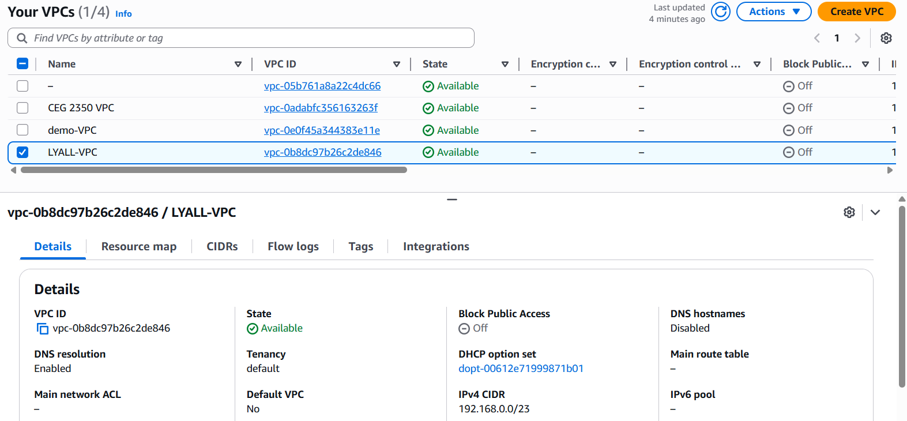
2. Creating a **Subnet**
   - The subnet is a collection of IPv4 addresses that will refer to the VPC.
     - In the AWS VPC console, click `Subnets` under `Virtual private cloud`.
     - Click `Create subnet`.
     - Under `VPC` select the `LYALL-VPC`.
     - Under `Subnet name` type `LYALL-Subnet`.
     - Under `IPv4 VPC CIDR block` select `192.168.0.0/23`.
     - Under `IPv4 subnet CIDR block` type `192.168.0.0/24`.
     - Click `Create subnet`.
   - The following IPv4 blocks were reserved with these settings:
     - Reserved: `192.168.0.0 - 192.168.0.255`
     - Remaining: `192.168.1.0 - 192.168.1.255`
   
   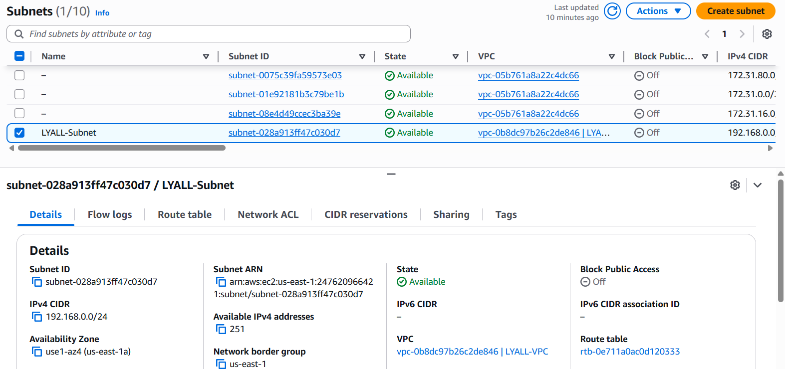
3. Creating an **Internet Gateway**
   - Internet gateways are how your VPC communicates with the large-scale web, it only needs to be attached to a VPC of your choice to function.
     - In the AWS VPC console, click `Internet gateways` under `Virtual private cloud`.
     - Click `Create internet gateway`.
     - Under `Name tag`, type `LYALL-gw`.
     - Click `Create internet gateway`.
     - Select your internet gateway.
     - Under `Actions` click `Attach to VPC`.
     - Under `Available VPCs` select `LYALL-VPC`.
     - Click `Attach internet gateway`.

   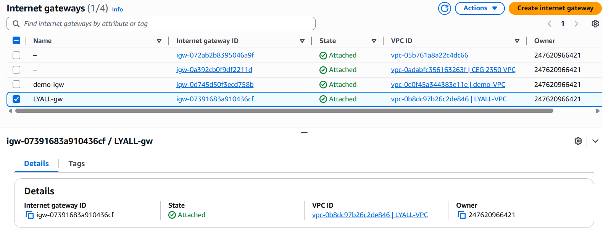
4. Creating a **Route Table**
   - A route table is a set of instructions that directs traffic passing between and through the VPC.
     - In the AWS VPC console, click `Route tables` under `Virtual private cloud`.
     - Click `Create route table`.
     - Under `Name - optional` type `LYALL-rt`.
     - Under `VPC` select `LYALL-VPC`.
     - Click `Create route table`.
     - Select your subnet.
     - Under `Subnet associations` and `Explicit subnet associations` click `Edit subnet associations`.
     - Under `Available subnets` select `LYALL-Subnet`.
     - Click `Save associations`.
     - Select your subnet.
     - Under `Routes` click `Edit routes`.
     - Click `Add route`.
     - Set `Destination` to `0.0.0.0/0`.
     - Set `Target` to `Internet Gateway`.
     - Under the `Internet Gateway` target select `LYALL-gw`.
     - Click `Save changes`.

   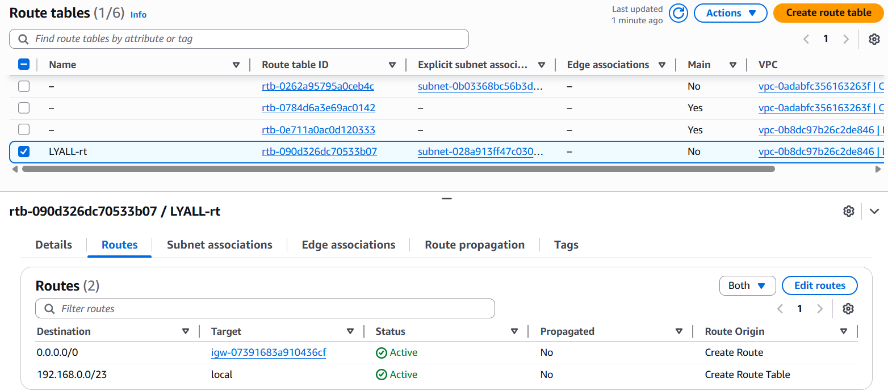
5. Creating a **Security Group**
   - A security group is a stateful firewall that determines which IPs are allowed to connect to the given VPC.
     - In the AWS VPC console, click `Security groups` under `Security`.
     - Click `Create security group`.
     - Under `Security group name` type `LYALL-sg`.
     - Under `Description` type `Enable SSH, ICMP, and HTTP access`.
     - Under `VPC` select `LYALL-VPC`.
     - Under `Inbound rules` enter the following rules:
       - Type: `SSH`, Source: `Custom` `Censored`, Description: `Home IP allowed to ssh`
       - Type: `SSH`, Source: `Custom` `130.108.0.0/16`, Description: `Wright State IP allowed to ssh`
       - Type: `SSH`, Source: `My IP`, Description: `Local IP allowed to ssh`
       - Type: `Custom ICMP - IPv4`, Source: `Custom` `Censored`, Description: `Home IP allowed to request ICMP`
       - Type: `Custom ICMP - IPv4`, Source: `Custom` `130.108.0.0/16`, Description: `Wright State IP allowed to request ICMP`
       - Type: `Custom ICMP - IPv4`, Source: `My IP`, Description: `Local IP allowed to request ICMP`
       - Type: `HTTP`, Source: `Anywhere-IPv4`, Description: `All IPs allowed to connect HTTP`
     - Under `Tags - optional` type `Name` under `Key` and `LYALL-sg` under `Value - optional`.
     - Click `Create security group`.
   
   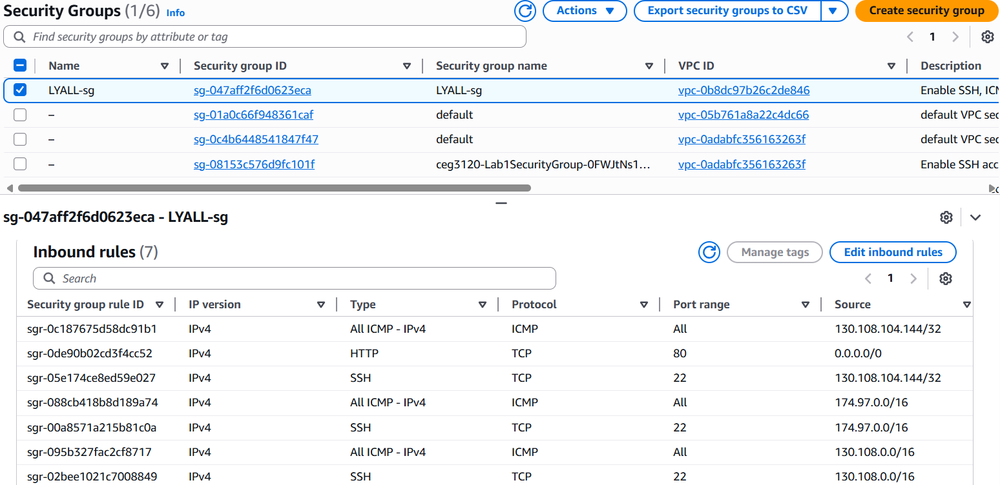
6. Creating a **Network ACL**
   - A network ACL or network access control list is a stateless firewall that allows or denies certain IPs from the given subnet.
     - In the AWS VPC console, click `Network ACLs` under `Security`.
     - Click `Create network ACl`.
     - Under `Name - optional` type `LYALL-nacl`.
     - Under `VPC` select `LYALL-VPC`.
     - Click `Create network ACL`.
     - Select your network ACL.
     - Under `Subnet associations` click `Edit subnet associations`.
     - Under `Available subnets` select `LYALL-Subnet`.
     - Click `Save changes`.
     - Under `Inbound rules` click `Edit inbound rules`.
     - Enter the following rules:
       - Rule Number: `100`, Type: `All traffic`, Source: `0.0.0.0/0`, Allow/Deny: `Allow`
       - Rule Number: `90`, Type: `All traffic`, Source: `107.23.4.178/32`, Allow/Deny: `Deny`
     - Click `Save changes`.
     - Under `Outbound rules` select `Edit outbound rules`.
     - Enter the following rules:
       - Rule Number: `100`, Type: `All traffic`, Source: `0.0.0.0/0`, Allow/Deny: `Allow`
       - Rule Number: `90`, Type: `All traffic`, Source: `5.9.243.187/32`, Allow/Deny: `Deny`
     - Click `Save Changes`.

   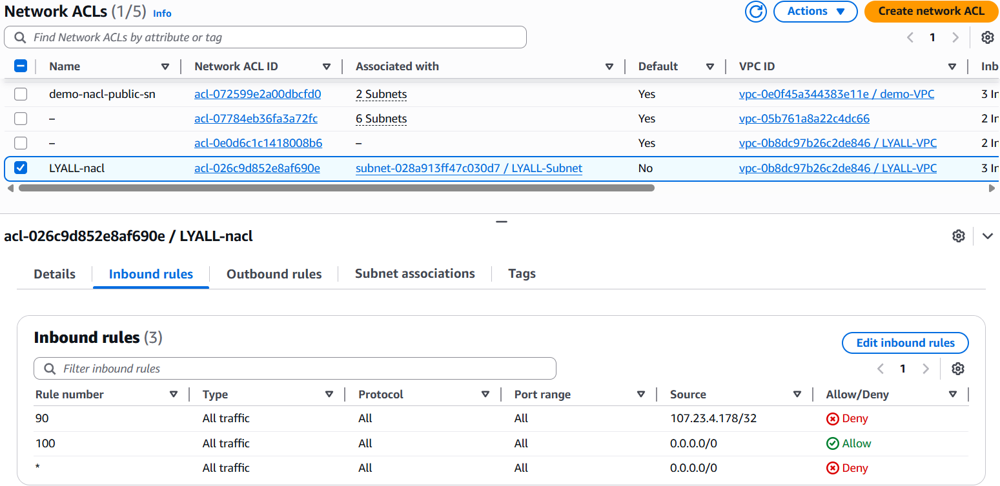
   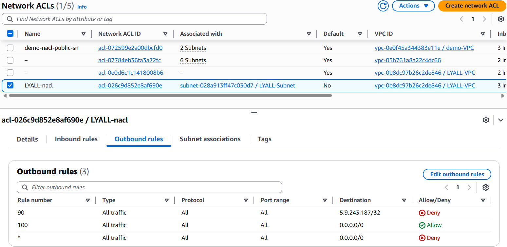
7. Identifying a **Key Pair**
   - AWS stores the public key of your key pair.
   - The key pair used in the instance soon to be created is called `vockey`.
   - The private key (in AWS Academy) is stored by the user to be used in `ssh`.
   - When creating an instance, the public key (`vockey`) must be identified to be added to the `known_hosts` file in default user's `.ssh` folder in the instance.
   - If the public key was correctly referred to in the instance, and the private key saved for `ssh`, the user can connect to the instance while it is running.

   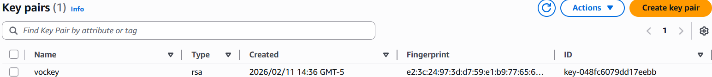
8. Reserving an **Elastic IP Address**
   - An elastic IP address is a public IP address that is associated with your AWS instance upon creation.
   - A new IP can be given when the instance is started, or an IP can be reserved so it can be reused when running `ssh`.
     - In the AWS VPC console, click `Elastic IPs` under `Virtual private cloud`.
     - Click `Allocate Elastic IP address`.
     - Click `Add new tag`.
     - Under `Key` type `Name`.
     - Under `Value - optional` type `LYALL-EIP`.
     - Click `Allocate`.
     - Select your elastic IP address.
     - Under `Actions` click `Associate Elastic IP address`.
     - Choose the appropriate `Instance` and `Private IP address`.
     - Click `Associate`.
   - An elastic IP will be assigned when an AWS instance is created.
   - An elastic IP is a public IP address assigned to your instance by AWS so it can be located publicly.
   - A public IP address is an IPv4 address that is owned by a larger body and loaned to smaller actors for a fee.

   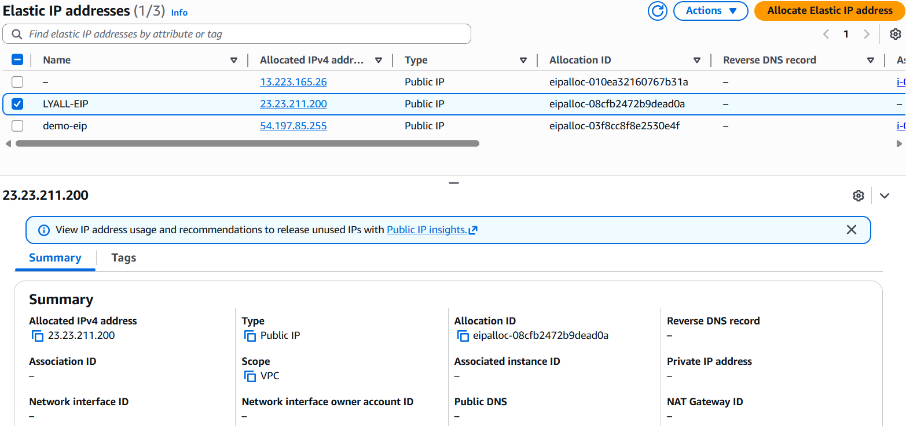
   
## Creating an EC2 Instance

1. Creating a **New Instance**
   - After creating your VPC and its associated rules, a new AWS instance can be created.
     - Under `Launch instance` in the EC2 Dashboard, click `Launch instance`.
     - Under `Name and tags` type `LYALL-instance`.
     - Under `Application and OS Images (Amazon Machine Image)` and `Quick Start` select `Ubuntu`.
     - Under `Application and OS Images (Amazon Machine Image)` and `Amazon Machine Image (AMI)` select `Ubuntu Server 24.04 LTS (HVM), SSD Volume Type`.
     - The default username for this image is `ubuntu`.
     - Under `Instance type` select `t3.micro`.
     - Under `Key pair (login)` select `vockey`.
       - The key pair is needed because without the key pair, it will be impossible to `ssh` to the instance even if the firewalls allow it.
     - Under `Network settings` click `Edit`.
     - Under `VPC - required` select `LYALL-VPC`.
     - Under `Subnet` select `LYALL-Subnet`.
     - Under `Auto-assign public IP` select `Disable`.
     - Under `Firewall (security groups)` select `Select existing security group`.
     - Under `Common security groups` select `LYALL-sg`.
     - Under `Configure storage` use `8 GiB` and `gp3`.
     - Click `Launch instance`.
2. Associating the **Elastic IP**
   - In order to `ssh` to this instance, an elastic IP is required. We will use the elastic IP we created earlier.
     - In the AWS VPC console, click `Elastic IPs` under `Virtual private cloud`.
     - Select `LYALL-EIP`.
     - Under `Actions` click `Associate Elastic IP address`.
     - Under `Resource type` select `Instance`.
     - Under `Instance` select `LYALL-instance`.
     - Under `Private IP address` select `192.168.0.96`.
     - Click `Associate`.
   
   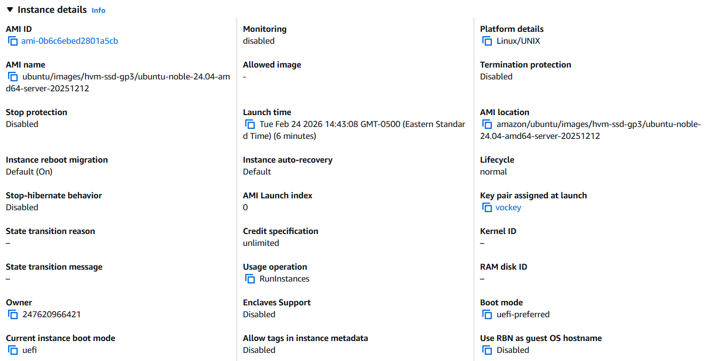
   
## Configuring an Instance

1. SSH into the **Instance**
   - SSH with the public IPv4 address found in EC2 and the private key file provided by the user.
     - Run `ssh -i (location of private key file) ubuntu@(instance public IPv4 address)` to SSH to the instance.
     - The public IPv4 address can be found by selecting the `LYALL-instance` instance in EC2 `Instances`.
2. Changing the **Hostname**
   - The hostname can be changed by running `sudo hostnamectl set-hostname`.
     - Run `sudo hostnamectl set-hostname "LYALL-ubuntu"`.
     - Restart the instance to apply the changes to the hostname.

   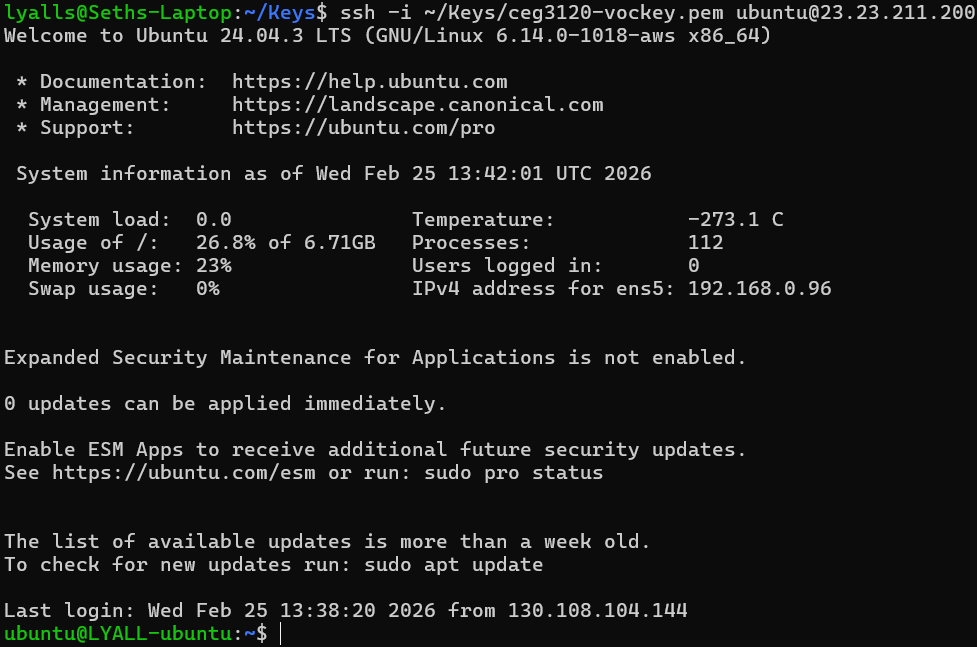
3. Testing the **Security**
   - Specific IPs and ports can be checked for each network ACL and security group with the `nc` (netcat) command.
   - The `ssh` command can be used to test `ssh` connections, and `curl` can be used to check outbound website connections.
   - The following commands check for:
     - A successful `ssh` from `130.108.0.0/16` (wright state): `ssh -i (location of private key file) ubuntu@(instance public IPv4 address)`

   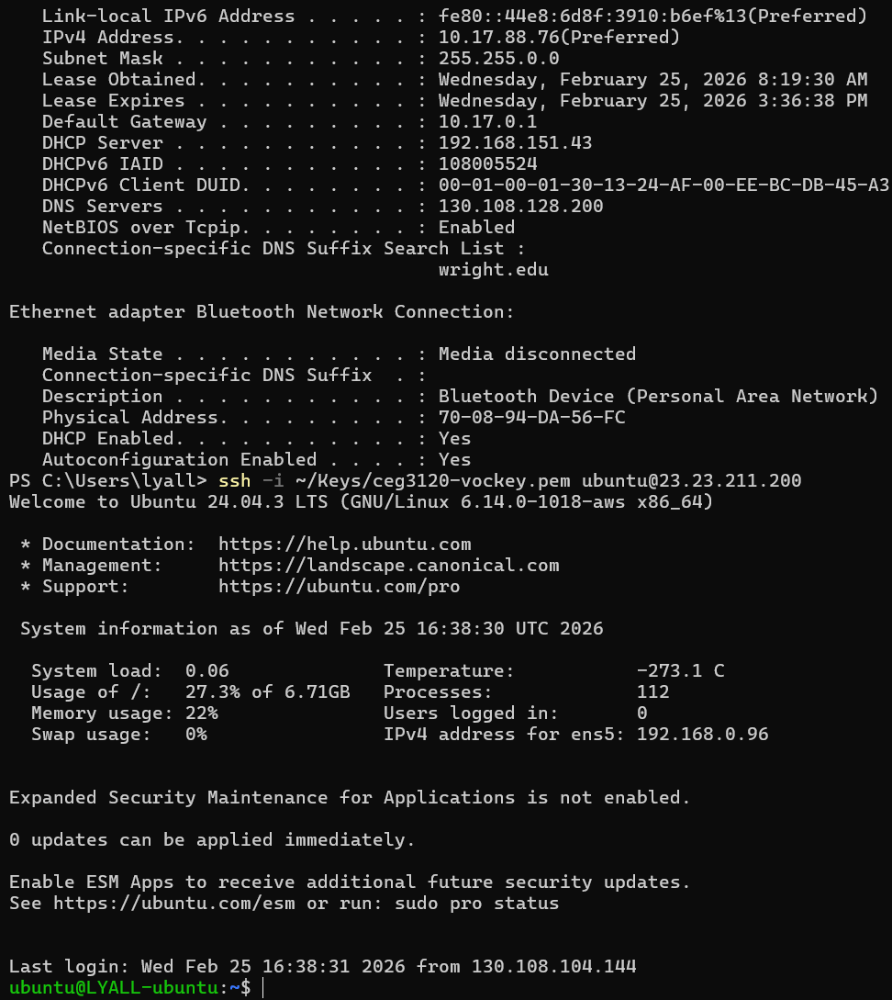
     - A successful `ssh` from `Censored` (my home ip): `ssh -i (location of private key file) ubuntu@(instance public IPv4 address)`

   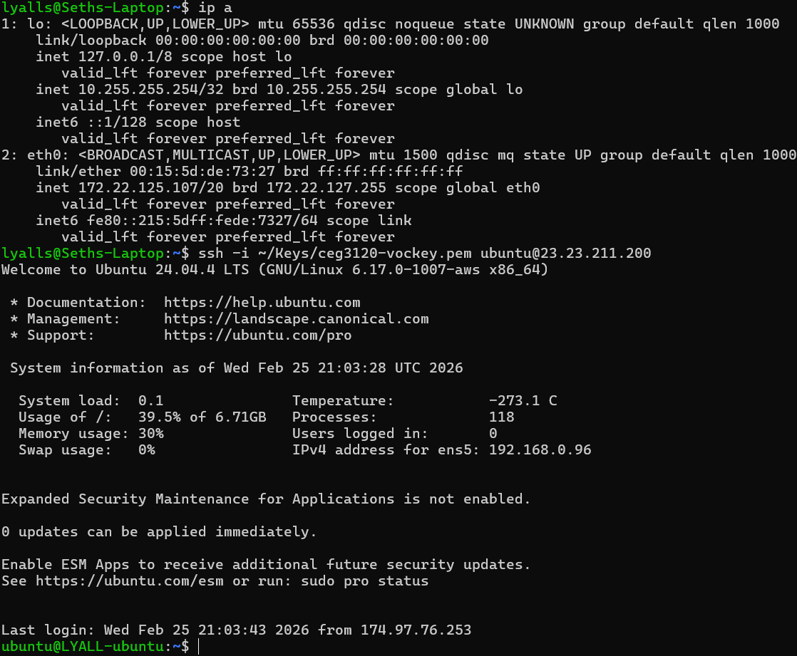
     - A successful http connection from `0.0.0.0/0` (anywhere): `nc -zv -w 5 (instance public IPv4 address) 80`
       - The instance needs to be listening on port 80 for an http connection to succeed.
       - Use `sudo nc -l 80` in the instance to start listening on port 80 before testing the connection.
   
   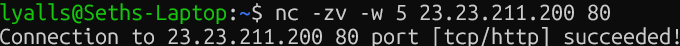
     - A failed outbound connection to `5.9.243.187` (wttr.in): `curl wttr.in`

   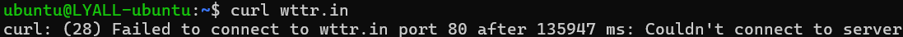
4. Installing **Docker**
   - The following commands can be used to install docker on the instance:
   ```
   sudo apt update   
   sudo apt install ca-certificates curl
   sudo install -m 0755 -d /etc/apt/keyrings
   sudo curl -fsSL https://download.docker.com/linux/ubuntu/gpg -o /etc/apt/keyrings/docker.asc
   sudo chmod a+r /etc/apt/keyrings/docker.asc

   sudo tee /etc/apt/sources.list.d/docker.sources <<EOF
   Types: deb
   URIs: https://download.docker.com/linux/ubuntu
   Suites: $(. /etc/os-release && echo "${UBUNTU_CODENAME:-$VERSION_CODENAME}")
   Components: stable
   Signed-By: /etc/apt/keyrings/docker.asc
   EOF

   sudo apt update
   sudo apt install docker-ce docker-ce-cli containerd.io docker-buildx-plugin docker-compose-plugin
   ```
   - Be sure to add the user to the `docker` group to ensure they can run docker commands without `sudo`.
   - A restart is necessary after adding the user to the `docker` group so their groups can be updated.
     - Run `sudo usermod -aG docker $USER` then reconnect to the instance to run docker commands without `sudo`.
     - Run `docker run hello-world` to test that docker is set up correctly.
   
## Resources

> I used this website to learn how to change a hostname. https://www.tecmint.com/set-hostname-permanently-in-linux/

> I used this website for resources on installing docker on Ubuntu. https://docs.docker.com/engine/install/ubuntu/
