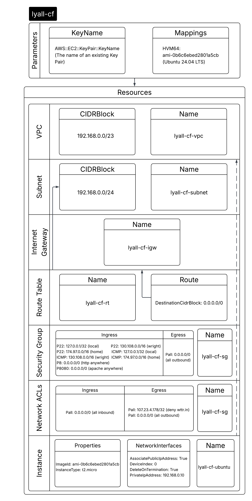

# CF Template

## Description

This is a cloud formation template that creates a VPC with a public subnet and an EC2 instance running Ubuntu 24.04 LTS. Every necessary setup step is performed automatically with no input needed from the user. The instance can be ssh'd to from the following allowed IPs:
- Locally: `127.0.0.1/32`
- Wright State: `130.108.0.0/16`
- My Home IP: `174.97.0.0/16`

The instance accepts HTTP and Apache2 connections from the following:
- HTTP: `0.0.0.0/0`
- Apache2: `0.0.0.0/0`

All outbound requests of any kind are allowed except for any request to wttr.in:
- wttr.in denied at: `107.23.4.178/32`

The instance renames the default hostname to `lyall-ubuntu`.
The instance installs the following programs upon creation:
- `curl`, `git`, `python3`, `pip3`, `apache2`, `wamerican`, and `docker`.

Docker is installed through the official installation `.sh` file provided by docker.
Two files are copied into the volume: `wordle.sh` at the default user's home directory and `index.html` at `/var/www/html/` for apache2.
The `wsukduncan/cheatsheet` container is pulled and ran upon instance creation to run in the background constantly and automatically restart if not stopped by the user.
A reboot is performed after everything is installed, the reboot may not occur immediately due to the time taken to install the software.

To build the template, paste the contents of `lyall-cf.yml` into the cloud formation infrastructure composer `Template` tab.
After verifying the template, it can be built by clicking `Create Template` and clicking `Next` untl you click `Submit`.

## Diagram

The following diagram visually depicts the cloud formation template and its parts. To the top is the title of the cloud formation template and its **Parameters**. The **Parameters** refer to the **VPC**, which is referred to while constructing the **Subnet**, **Internet Gateway**, **Route Table**, **Security Group**, and **Network ACLs**. Every item has a *Name Tag* formatted `lyall-cf-(item)`, where "(item)" is an abbreviated form of the name of the cloud formation template item. Arrows in the diagram mean that the item at the start of the arrow is referencing (`!Ref`) the item at the end of the arrow. A dashed arrow means that everything behind the arrow refers to the item at the end of the arrow.

## Resources

> I used this website to learn how to automatically restart docker containers. https://docs.docker.com/engine/containers/start-containers-automatically/

> I used this website to learn about alternative docker installation methods. https://docs.docker.com/engine/install/ubuntu/
