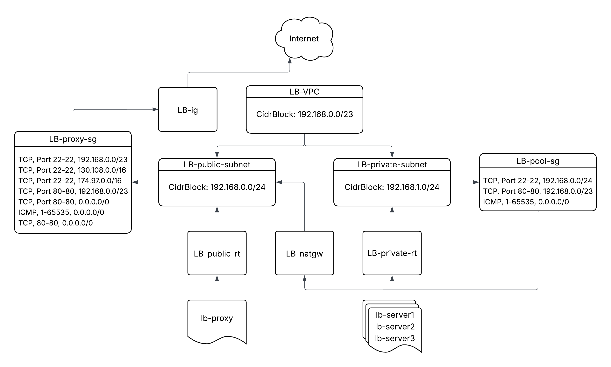
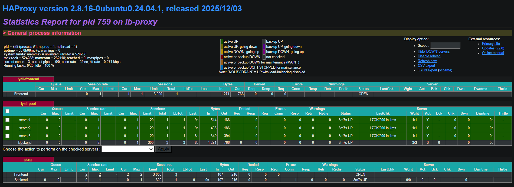
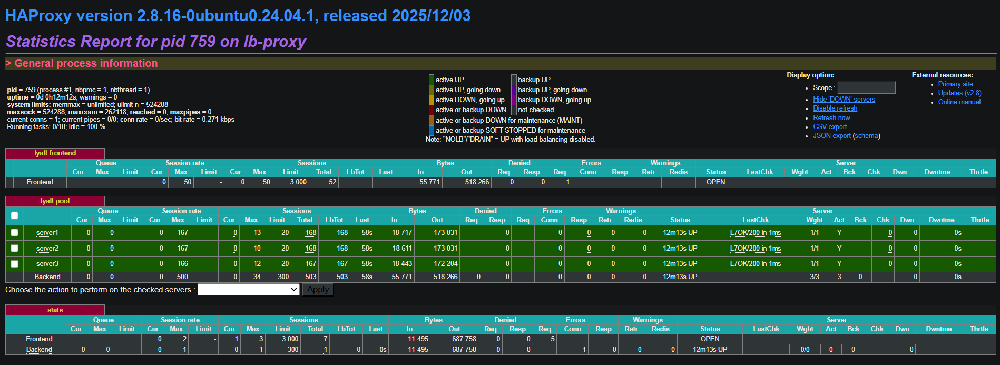

# Project 3

## Project Description

The purpose of this project is to create a website with automatic load balancing capabilities that can handle somewhat large amounts of traffic. The website is made with basic html and css and is deployed in a docker container with an httpd image. This container is ran in multiple private servers bound to port 80 both ways. A proxy server listens on port 80 to direct any traffic to an available private server from the server pool round-robin style. The websites can be accessed through the public ip of the proxy server, and the haproxy stats page can be accessed at `*:8080/stats` where * is the public ip used to access the proxy server. The proxy servers and pool of private servers are created through Amazon Web Services (AWS) using a cloudformation template called `lyall-lb-cf.yml`. Each private server docker container is built with the `lyalls2004/the-website:latest` image from Docker Hub found at https://hub.docker.com/r/lyalls2004/the-website.

To create the stack with the cloudformation template `lyall-lb-cf.yml`, you must paste the raw text or upload the file to cloudformation when creating a stack in AWS. This cloudformation template creates a VPC called `LB-VPC` with a CIDR block of `192.168.0.0/23`. All of the following items reference this VPC: 
- A public subnet called `LB-public-subnet` over `192.168.0.0/24`
- A private subnet called `LB-private-subnet` over `192.168.1.0/24`
- An internet gateway called `LB-gw`
- A public route table called `LB-public-rt`
- A NAT gateway called `LB-natgw`
- A private route table called `LB-private-rt`
- A public security group called `LB-proxy-sg`
- A private security group called `LB-pool-sg`
- A proxy instance called `lb-proxy`
- Three private instances called `lb-server1`, `lb-server2`, and `lb-server3`

Here is a diagram visualizing the `lyall-lb-cf.yml` cloudformation template:



## Building a Web Service Container

The website that is served by the load balancer is hosted within docker containers. These containers are spun up within each server in the pool and are available at all times. I made the website myself, and placed it in a `httpd:2.4` container in the web content directory `/usr/local/apache2/htdocs`. When starting the containers, they are bound to host and container port 80. Here are the locations of the [web-content](web-content) folder and the [Dockerfile](web-content/Dockerfile).

The commands ran to build, tag, push, pull, and run the container using the `Dockerfile` are as follows (you must be in the directory of Dockerfile to use this build command):
- Building: `docker build -t the-website:latest .`
- Tagging: `docker tag the-website:latest lyalls2004/the-website:latest`
- Pushing: `docker push lyalls2004/the-website:latest`
- Pulling (in the container): `docker pull lyalls2004/the-website:latest`
- Running (in the container): `docker run -d --restart always -p 80:80 lyalls2004/the-website:latest`

Pushing an image to Docker Hub requires you to be logged in through your terminal. To log in, a Personal Access Token (PAT) is required. To generate a personal access token on Docker Hub, select your **profile**, open **account settings**, select **generate new token**, add a **description**, **expiration date**, and **access permissions**, and select **generate**. This new key must be pasted in terminal to log you in to your Docker Hub account when prompted. You can not view this key again, so it is important to save it. It is recommended to only make tokens when necessary (specific permissions are needed). For the strongest security, different tokens can be used for read, write, and delete access so one token doesn't grant full access to your account.

Once again, here is the link to this projects Docker Image: https://hub.docker.com/r/lyalls2004/the-website

## Connections to Instances Within the VPC

There are several ways to connect with instances in this projects VPC, `ssh` connection allows the most extensive analysis and management for debugging or modifying content. `ssh` connections can be simplified by modifying the `/etc/hosts` file in a linux filesystem. This project uses Ubuntu, for example. `ssh` commands are also long, they can be shortened down to a single word using the `.ssh/config` file.

An entry in the `/etc/hosts` file is very simple. It consists of a ipv4 or ipv6 address and one or more names to refer to it as. Instead of typing the ip address into a browser, adding these entries to the `/etc/hosts` file allows these ip addresses to be visited by entering the provided labels. Here are a couple examples:
```
127.0.0.1       localhost
52.200.68.217   the-website     the-website.com     the-website.io
```

An entry in the `.ssh/config` file is made up of several parts that form an `ssh` command: The **Host**, **Hostname**, **User**, **Port**, and **IdentityFile**. When all fields are correctly entered in the following example, the `ssh` command can instead be ran as `ssh lyall-lb`:
```
Host lyall-lb
    Hostname ubuntu
    User ubuntu
    Port 22
    IdentityFile ~/Keys/ceg3120-vockey.pem
```

In order to `ssh` between instances in the `LB-VPC`, the current shell we are in must have the chosen public key. As long as we can refer within our current shell to the appropriate key in the `.ssh/authorized_keys` file in the remote instance and the NACLs and Security Groups allow `ssh` connection at our ip, then the `ssh` connection will be successful. To make the `ssh` process easier, the `/etc/hosts` and `.ssh/config` files can be edited during instance creation in the `lyall-lb-cf.yml` file or by the user after the stack is created. To build each file entry, simply refer to a successful `ssh` command.

## Setting Up the HAProxy Load Balancing Instance

The location of the `haproxy.cfg` file on the Ubuntu instance used in this project is `/etc/haproxy/haproxy.cfg`. [Here](haproxy.cfg) is the location of the file in the project repo. The sections in this projects `haproxy.cfg` file are `global`, `defaults`, `frontend`, `backend`, and `listen`.
- The `global` section sets log locations, updates the haproxy root location and permissions, and runs the service daemon.
- The `defaults` section sets timeouts in seconds, refers to the log locations in `global`, sets the default mode to `http`, tells the service to log `http` messages and to not log `null` messages, sets the maximum connections to 3000, and specifies `http` error file locations.
- The `frontend` section defines frontends, in this case, `lyall-frontend` connected to the proxy server at `192.168.0.10:80`.
- The `backend` section defines backends or individual servers, in this case, `server1` through `server3` that provide the web content through the `httpd` docker container. This section specifies the load balancing technique, in this case `roundrobin`. It specifies 20 max connections to `192.168.1.10:80`, `192.168.1.20:80`, and `192.168.1.30:80`
- The `listen` section defines the haproxy stats page, where an admin can view information about the load balancer such as what resources are being used and how many connections are being served. They can also, with admin privileges, perform actions on servers such as shutting them down or emptying them.

The `haproxy.cfg` file can be tested without restarting the service by running `haproxy -c -f (haproxy.cfg location)`. This command tells you what errors are in the file and where they are. If the file is valid, the output should be `Configuration file is valid`.

In case another service such as `apache` overrwrites the `haproxy` service, the other service must be stopped and possible disabled if it was started automatically. Haproxy must then be started again. This can be done using the `systemctl` command. To stop the `apache` service, run `systemctl stop apache` then `systemctl start haproxy`. `systemctl enable haproxy` should be used if running `systemctl status haproxy` and it is not enabled. If the `haproxy.cfg` file was edited, the service must be restarted. The `systemctl` command can achieve this also. Run `systemctl restart haproxy` to restart the service. If there are no errors in `haproxy.cfg`, then the service should be running with the new settings and users should immediately be able to connect.

## Prove the Load Balancer is Working

Using the round robin approach, the `haproxy` load balancer is sending each http request to the first available server. The first user to request http content gets sent to the first server, the second user to the second, and so on so forth. Here is the stats panel for the website with no load:



Running individual websites puts little to no load on the load balancer, so a program to generate many requests is necessary for testing. I used `hey`, an open source program that generates a specified number of requests and sends them to your chosen url. Here is the stats panel for the website after running `hey` with 500 requests using `hey -n 500 http://52.200.68.217/`:



After running `hey`, the first two servers received 167 requests, and the third server received 166 requests. The number of requests sent to each server match the round robin approach that was specified in the `haproxy.cfg` file.

## Resources

> I used this website to learn about the haproxy config file. https://www.haproxy.com/blog/the-four-essential-sections-of-an-haproxy-configuration

> I Used this website to learn about the haproxy stats page. https://www.haproxy.com/blog/exploring-the-haproxy-stats-page

> I used this website to learn about Docker Personal Access Tokens. https://docs.docker.com/security/access-tokens/